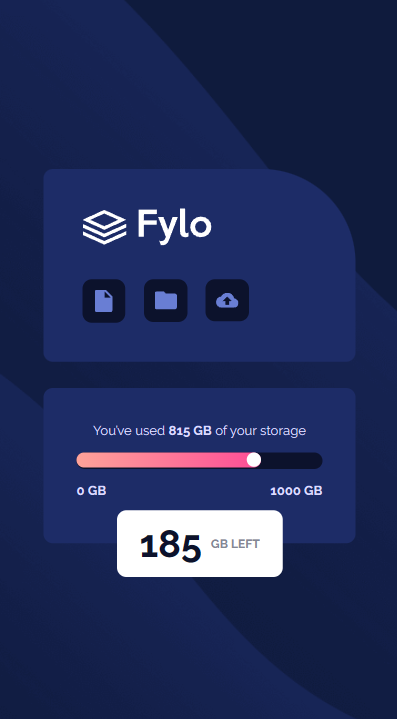

# Frontend Mentor - Fylo data storage component

This is a solution to the [Fylo data storage component challenge on Frontend Mentor](https://www.frontendmentor.io/challenges/fylo-data-storage-component-1dZPRbV5n). Frontend Mentor challenges help you improve your coding skills by building realistic projects. 

## Table of contents

- [Overview](#overview)
  - [The challenge](#the-challenge)
  - [Screenshot](#screenshot)
  - [Links](#links)
- [My process](#my-process)
  - [Built with](#built-with)
  - [What I learned](#what-i-learned)
  - [Useful resources](#useful-resources)
- [Author](#author)
- [Acknowledgments](#acknowledgments)

## Overview

### The challenge

Users should be able to:

- View the optimal layout for the site depending on their device's screen size

### Screenshot

### Links

- Solution URL: [https://github.com/manjubhaskar02/FM-7-fylo-data-storage-component-master](https://github.com/manjubhaskar02/FM-7-fylo-data-storage-component-master)
- Live Site URL: [https://manjubhaskar02.github.io/FM-7-fylo-data-storage-component-master/](https://manjubhaskar02.github.io/FM-7-fylo-data-storage-component-master/)

## My process

### Built with

- Semantic HTML5 markup
- CSS custom properties
- CSS Grid

### What I learned
This section was helpful for learning css grid.
## Author

- Frontend Mentor - [@manjubhaskar02](https://www.frontendmentor.io/profile/manjubhaskar02)

## Acknowledgments

I want to thank my hubby who inspires me and Hassai Issah who took the pain to read my code and helping me to correct my mistakes.